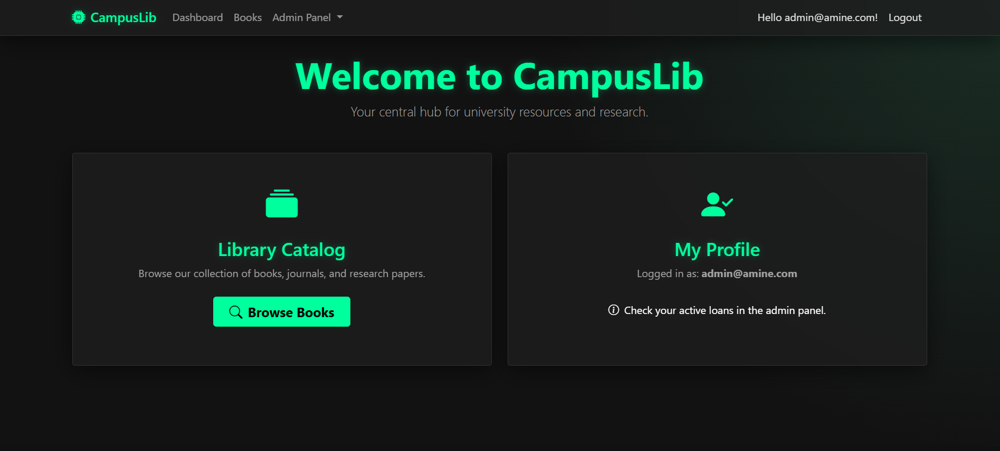
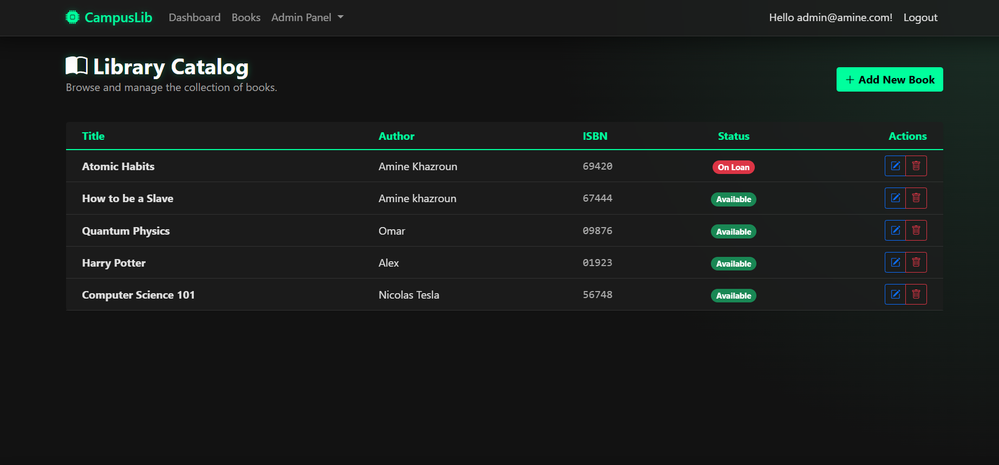

# 📚 CampusLib - Modern Library Management System


**CampusLib** is a full-stack Library Management System built with **ASP.NET Core 8 MVC**. It features a modern dark UI, role-based security, and full orchestration support via Docker and Kubernetes.

---

## 🚀 Features

### 🎨 User Interface (UI)
* **Custom Theme:** "Charcoal & Neon Green" Cyberpunk aesthetic.
* **Glassmorphism:** Semi-transparent cards, tables, and navbars with blur effects.
* **Responsive:** Fully mobile-friendly layout using Bootstrap 5.

### 👤 User Roles
* **Guest:** View welcome page and login/register.
* **Student (Auth User):** * Browse the Book Catalog.
    * View availability status (Available/On Loan).
    * Manage personal profile.
* **Administrator:**
    * **Book Management:** Create, Edit, Delete books.
    * **Loan Management:** Issue books to users, track return dates, and view history.
    * **User Management:** View and delete user accounts.

---

## 🛠️ Tech Stack

* **Framework:** ASP.NET Core 8.0 (MVC)
* **ORM:** Entity Framework Core
* **Database:** * *Development:* SQL Server LocalDB
    * *Production:* SQL Server 2022 (Docker Container)
* **Frontend:** Razor Views, Bootstrap 5, Bootstrap Icons, Custom CSS

---

## 💻 Getting Started (Local Development)

### Prerequisites
* Visual Studio 2022 (with Web Dev workload)
* .NET 8.0 SDK
* SQL Server LocalDB (Installed with VS)

### Installation
1.  **Clone the repository**
    ```bash
    git clone [https://github.com/yourusername/LibraryApp.git](https://github.com/yourusername/LibraryApp.git)
    cd LibraryApp
    ```

2.  **Database Migration**
    Open the **Package Manager Console** in Visual Studio and run:
    ```powershell
    Update-Database
    ```
    *This creates the `LibraryDb` database and seeds the initial Admin account.*

3.  **Run the Application**
    * Select **"https"** or **"LibraryApp"** from the launch profile dropdown (do not select Docker yet).
    * Press **F5**.

4.  **Default Admin Credentials**
    * **Email:** `admin@amine.com`
    * **Password:** `Amine123!`

---

## 📂 Project Structure

CampusLib/
├── WebApplication2/
│   ├── Controllers/       # Logic for Books, Loans, Users
│   ├── Data/              # EF Core Context & Seeder
│   ├── Models/            # Database Entities
│   ├── Views/             # Razor Pages (UI)
│   ├── wwwroot/           # CSS, JS, Images
│   └── Program.cs         # App entry point & Config

---

## 📸 Screenshots


| Dashboard | Book Catalog |
|:---:|:---:|
|  |  |

---

Made by Med Amine Khazroun

